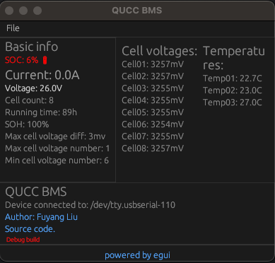

Learing about USB - And a simple QUCC BMS

## About QUCC BMS

I have no connection to the QUCC BMS company, only making a tool 
for my own project and this code has no guarantee of any stable 
functionality and is not very well maintained. But if it works
for you, feel free to continue with it, contribute or share the code.

So basically if you have Rust installed, and connect the QUCC BMS
via a USB, then you might be able to get the BMS info by running
the commandline tool or a GUI tool.

```
cargo run --bin usb-qucc

cargo run --bin qucc-egui
```

To play and develop on your own with QUCC BMS, the pdf doc here
[QUCC BMS ModbusRTU Communication Protocol V1.6](QUCC%20BMS-ModbusRTU%20Communication%20ProtocolV1.6-User%20Edition.pdf).



## About USB development

https://www.youtube.com/watch?v=YV6Qa5vHAV8&t=601s

# In order to build a runnable file on raspberry pi
A few resources:
* https://pixelspark.nl/2020/cross-compiling-rust-programs-for-a-raspberry-pi-from-macos
* https://medium.com/swlh/compiling-rust-for-raspberry-pi-arm-922b55dbb050
* https://jakewharton.com/cross-compiling-static-rust-binaries-in-docker-for-raspberry-pi/
* https://chacin.dev/blog/cross-compiling-rust-for-the-raspberry-pi/

About [Rust platform support](https://doc.rust-lang.org/nightly/rustc/platform-support.html).

I found this setup could make it work for my RPi3+:
```
brew install arm-linux-gnueabihf-binutils
rustup target add armv7-unknown-linux-musleabihf
touch .cargo/config.toml
```

And in the `.cargo/config.toml` file we can write:

```toml
[target.armv7-unknown-linux-musleabihf]
linker = "arm-linux-gnueabihf-ld"
```

Notice the target is availabe from the rustup targe add command, and the linker is avialabel due to our
brew install command above.

There is also a `armv7-unknown-linux-gnueabihf` but somehow it seems not working for me as I encountered an error like:

```
pkg-config has not been configured to support cross-compilation ... Install a sysroot blablabla and config via PKG_CONFIG_SYSROOT_DIR blablabla...
```

And using `armv7-unknown-linux-musleabihf`
is probably just better as this will do statically link with musl, which can probably make less problems and just copy the built bianry file to our
Raspberry Pi then it should just run.

Noting that
* use `armv7-unknown-linux-musleabihf` for R Pi 2/3/4
* use `arm-unknown-linux-musleabihf` for R Pi 1

## Other notes

```
stty -f /dev/tty.debug-console -a
```